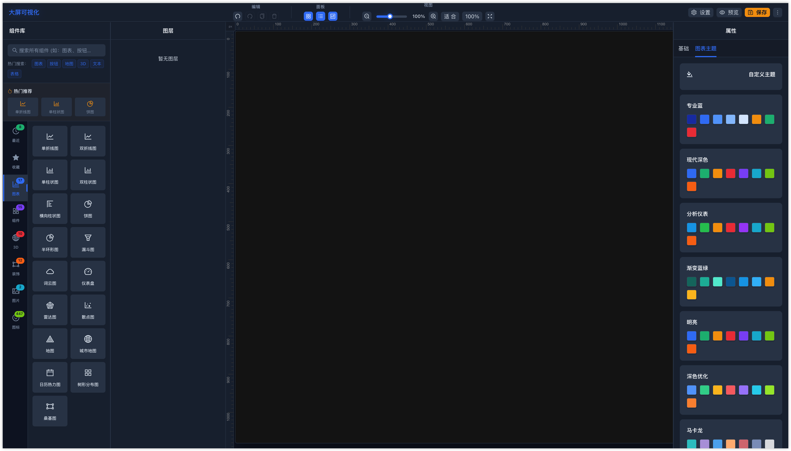

# 🎨 可视化大屏编辑器

VeloData: 取自 Velocity（速度），强调快速生成数据可视化。

一个功能强大的可视化大屏编辑器，支持拖拽式组件布局、实时预览、丰富的图表组件和炫酷的 3D 效果。适用于数据大屏、监控面板、展示页面等场景。

[](https://github.com/your-repo/visualization-dashboard)
[](https://www.typescriptlang.org/)
[](https://reactjs.org/)
[](https://ant.design/)
[](LICENSE)

## ✨ 预览地址
[🔗 在线体验](https://visualization-dashboard-sooty.vercel.app/)

## 📸 项目截图


## 🛠️ 技术栈

- **前端框架**: React 19.2.0 + TypeScript 5.9.3
- **构建工具**: Vite 7.2.5 (Rolldown)
- **UI 组件**: Ant Design 6.1.4
- **图表库**: ECharts 6.0.0
- **拖拽功能**: React DnD 16.0.1
- **3D 渲染**: React Three Fiber 9.5.0 + Three.js 0.182.0
- **状态管理**: React Context + useReducer
- **样式方案**: Less 4.5.1
- **路由管理**: React Router DOM 7.12.0

## 🚀 核心功能

### 📊 丰富的组件库 (50+ 组件)

#### 图表组件 (17种)
- **基础图表**: 单/双折线图、单/双柱状图、横向柱状图、饼图、半环形图
- **高级图表**: 仪表盘、雷达图、散点图、漏斗图、词云图
- **地理图表**: 地图、城市地图
- **时间图表**: 日历热力图
- **关系图表**: 树形分布图、桑基图

#### UI 组件 (13种)
- **基础组件**: 文本、按钮、输入框、选择器、开关、进度条
- **展示组件**: 标签、徽标、头像、卡片
- **数据组件**: 表格、滚动排名列表、轮播列表

#### 3D 组件 (10种)
- **天体效果**: 3D地球、星系、等离子球
- **粒子系统**: 粒子背景、3D波浪、矩阵雨
- **几何体**: 3D魔方、DNA螺旋、3D环形、时空隧道

#### 装饰组件 (7种)
- **边框装饰**: 科技边框1/2/3、自定义图片边框、装饰元素1/2
- **功能组件**: 全屏按钮
- **特效文字**: 渐变文字、倒计时、科技标题

#### 布局组件 (4种)
- **多栏布局**: 两栏、三栏布局
- **区域布局**: 头部布局、侧栏布局

#### 媒体组件 (2种)
- **图片组件**: 静态图片、轮播图

### 🎯 编辑功能

#### 基础编辑
- ✅ **拖拽编辑**: 支持组件拖拽、移动、缩放
- ✅ **智能吸附**: 自动对齐和吸附功能，精确到像素
- ✅ **多选操作**: 支持框选、Ctrl多选、批量操作
- ✅ **复制粘贴**: 快速复制组件，支持偏移放置
- ✅ **撤销重做**: 完整的历史记录管理 (20步历史)

#### 高级编辑
- ✅ **组合功能**: 支持组件组合和取消组合
- ✅ **图层管理**: 支持图层排序、显示/隐藏、锁定
- ✅ **对齐分布**: 智能对齐线、网格吸附
- ✅ **尺寸调整**: 8个控制点精确调整大小
- ✅ **右键菜单**: 丰富的上下文操作菜单

### 📐 画布功能

#### 视图控制
- ✅ **自由缩放**: 20%-200% 缩放范围，支持滚轮缩放
- ✅ **专注模式**: Zen模式，隐藏面板专注编辑
- ✅ **适应屏幕**: 一键适应画布到屏幕大小
- ✅ **标尺网格**: 精确的标尺和网格辅助线

#### 画布配置
- ✅ **自定义尺寸**: 支持任意画布尺寸设置
- ✅ **背景设置**: 纯色背景、图片背景、透明度控制
- ✅ **背景模式**: 平铺、拉伸、填充、适应、居中
- ✅ **主题配置**: 内置多种图表主题

### 🔗 数据源支持

#### 数据类型
- ✅ **静态数据**: 支持手动配置 JSON 数据
- ✅ **API 接口**: 支持 RESTful API 数据源
- ✅ **实时刷新**: 支持数据自动刷新 (1-3600秒)
- ✅ **数据映射**: 灵活的数据字段映射和路径提取

#### API 配置
- ✅ **请求方法**: GET、POST、PUT、DELETE
- ✅ **请求头**: 自定义 Headers 配置
- ✅ **请求参数**: Query 参数和 Body 参数
- ✅ **数据路径**: 支持嵌套数据路径提取 (如: `data.result.chartInfo`)

### 🎨 样式配置

#### 属性面板
- ✅ **实时预览**: 所见即所得的编辑体验
- ✅ **分类配置**: 基础属性、样式属性、数据配置
- ✅ **颜色选择**: 内置颜色选择器，支持透明度
- ✅ **字体配置**: 字体大小、颜色、粗细设置

#### 响应式设计
- ✅ **多屏适配**: 支持桌面、平板、手机三种布局
- ✅ **面板收缩**: 小屏幕自动收缩侧边面板
- ✅ **触摸支持**: 移动端触摸操作优化

### 💾 项目管理

#### 导入导出 (🆕)
- ✅ **项目导出**: 完整项目 JSON 格式导出
- ✅ **项目导入**: 支持项目文件导入，自动处理 ID 冲突
- ✅ **复制数据**: 一键复制项目数据到剪贴板，方便分享和备份
- ✅ **模板保存**: 将当前画布保存为可复用模板
- ✅ **组件导出**: 导出选中的组件为独立文件
- ✅ **数据验证**: 严格的文件格式验证和错误处理

#### 本地存储
- ✅ **自动保存**: 编辑状态自动保存到 localStorage
- ✅ **状态同步**: 编辑页面和预览页面状态同步
- ✅ **历史记录**: 完整的操作历史记录

## 🏃‍♂️ 快速开始

### 环境要求
- **Node.js**: >= 16.0.0
- **npm**: >= 7.0.0 或 **yarn**: >= 1.22.0
- **浏览器**: Chrome >= 88, Firefox >= 85, Safari >= 14

### 安装运行

```bash
# 克隆项目
git clone https://github.com/your-username/visualization-dashboard.git
cd visualization-dashboard

# 安装依赖 (推荐使用 npm)
npm install

# 启动开发服务器
npm run dev
# 服务器将在 http://localhost:3001 启动

# 构建生产版本
npm run build

# 预览构建结果
npm run preview

# 代码检查
npm run lint
```

### Docker 部署 (可选)

```bash
# 构建 Docker 镜像
docker build -t visualization-dashboard .

# 运行容器
docker run -p 3000:3000 visualization-dashboard
```

## 📁 项目结构

```
visualization-dashboard/
├── public/                        # 静态资源
│   ├── api/                      # 模拟 API 数据
│   └── map/                      # 地图 JSON 数据
├── src/
│   ├── pages/
│   │   ├── edit/                 # 编辑器主页面
│   │   │   ├── components/
│   │   │   │   ├── Canvas/       # 画布区域
│   │   │   │   │   ├── index.tsx         # 画布主组件
│   │   │   │   │   ├── CanvasItem.tsx    # 画布项渲染
│   │   │   │   │   ├── MapChart.tsx      # 地图组件
│   │   │   │   │   ├── WordCloudChart.tsx # 词云组件
│   │   │   │   │   └── ...               # 其他专用组件
│   │   │   │   ├── ComponentPanel/      # 组件面板
│   │   │   │   │   └── index.tsx         # 组件库和搜索
│   │   │   │   ├── PropertyPanel/       # 属性面板
│   │   │   │   │   ├── index.tsx         # 属性配置主面板
│   │   │   │   │   ├── DataSourceEditor.tsx # 数据源编辑器
│   │   │   │   │   └── ChartThemeEditor.tsx  # 图表主题编辑器
│   │   │   │   ├── LayerPanel/           # 图层面板
│   │   │   │   ├── Toolbar/              # 工具栏
│   │   │   │   │   └── index.tsx         # 工具栏和导入导出
│   │   │   │   ├── Ruler/                # 标尺组件
│   │   │   │   └── ResponsiveLayout/     # 响应式布局
│   │   │   ├── context/                  # 状态管理
│   │   │   │   └── EditorContext.tsx     # 编辑器上下文
│   │   │   ├── config/                   # 配置文件
│   │   │   │   ├── constants.ts          # 常量配置
│   │   │   │   └── defaultConfigs.ts     # 默认组件配置
│   │   │   ├── types/                    # TypeScript 类型定义
│   │   │   │   └── index.ts              # 核心类型定义
│   │   │   ├── utils/                    # 工具函数
│   │   │   │   ├── chartOptions.ts       # 图表配置生成
│   │   │   │   ├── dataSource.ts         # 数据源处理
│   │   │   │   ├── importExport.ts       # 导入导出功能
│   │   │   │   ├── mapData.ts            # 地图数据处理
│   │   │   │   └── snapping.ts           # 智能吸附算法
│   │   │   └── hooks/                    # 自定义 Hooks
│   │   │       └── useDragResize.ts      # 拖拽缩放逻辑
│   │   └── preview/                      # 预览页面
│   │       └── index.tsx                 # 预览模式渲染
│   ├── components/                       # 全局组件
│   │   ├── ColorPreview.tsx             # 颜色预览组件
│   │   └── ErrorBoundary.tsx            # 错误边界组件
│   ├── styles/                          # 全局样式
│   │   └── variables.less               # Less 变量定义
│   └── utils/                           # 全局工具函数
│       └── debounce.ts                  # 防抖函数
├── docs/                               # 文档和截图
├── dist/                               # 构建输出目录
├── .kiro/                              # Kiro AI 配置
├── package.json                        # 项目配置
├── tsconfig.json                       # TypeScript 配置
├── vite.config.ts                      # Vite 构建配置
└── README.md                           # 项目文档
```

## 🎮 使用指南

### 基础操作

#### 添加组件
1. 从左侧**组件面板**选择所需组件类型
2. 拖拽组件到画布中央
3. 组件会自动添加并选中

#### 编辑组件
1. **选择**: 点击画布上的组件进行选择
2. **移动**: 拖拽选中的组件进行移动
3. **调整大小**: 拖拽组件四角和边缘的控制点
4. **配置属性**: 在右侧**属性面板**配置样式和数据

#### 多选操作
- **框选**: 在空白区域拖拽框选多个组件
- **Ctrl多选**: 按住 `Ctrl/Cmd` 点击多个组件
- **全选**: `Ctrl/Cmd + A` 选择所有组件

### 高级功能

#### 组件管理
- **组合**: 选中多个组件后右键选择"组合"
- **取消组合**: 选中组合后右键选择"取消组合"
- **图层操作**: 在**图层面板**中管理组件层级关系
- **锁定/解锁**: 防止组件被意外移动

#### 数据配置
1. 选中图表组件
2. 在**属性面板**中找到"数据配置"
3. 选择数据源类型：
   - **静态数据**: 直接编辑 JSON 数据
   - **API接口**: 配置接口地址和参数
4. 设置数据刷新间隔（可选）

#### 项目管理
- **导出项目**: 工具栏 → 更多 → 导出项目
- **导入项目**: 工具栏 → 更多 → 导入项目
- **复制数据**: 工具栏 → 更多 → 复制数据（复制到剪贴板）
- **保存模板**: 工具栏 → 更多 → 保存为模板
- **预览**: 点击工具栏"预览"按钮

### 快捷键

| 快捷键 | 功能 | 说明 |
|--------|------|------|
| `Ctrl/Cmd + Z` | 撤销 | 撤销上一步操作 |
| `Ctrl/Cmd + Y` | 重做 | 重做被撤销的操作 |
| `Delete/Backspace` | 删除 | 删除选中的组件 |
| `Ctrl/Cmd + C` | 复制 | 复制选中的组件 |
| `Ctrl/Cmd + V` | 粘贴 | 粘贴复制的组件 |
| `Ctrl/Cmd + A` | 全选 | 选择所有组件 |
| `Ctrl/Cmd + 点击` | 多选 | 添加/移除组件选择 |
| `Space + 拖拽` | 画布移动 | 移动画布视图 |
| `Ctrl/Cmd + 滚轮` | 缩放 | 缩放画布 |

## 🌟 特色亮点

### 🎨 现代化 UI 设计
- **深色主题**: 专业的深色界面设计
- **毛玻璃效果**: 现代化的 Glassmorphism 视觉效果
- **流畅动画**: 丰富的过渡动画和交互反馈
- **响应式布局**: 完美适配各种屏幕尺寸

### 🚀 性能优化
- **虚拟化渲染**: 大量组件时的性能优化
- **懒加载**: 组件按需加载，减少初始包大小
- **内存管理**: 智能的组件销毁和内存回收
- **构建优化**: Vite + Rolldown 极速构建

### 🔧 开发体验
- **TypeScript**: 完整的类型定义和智能提示
- **热更新**: 开发时的快速热更新
- **错误边界**: 完善的错误处理和用户提示
- **调试友好**: 清晰的组件结构和状态管理

### 🎯 用户体验
- **直观操作**: 拖拽式的可视化编辑
- **智能辅助**: 自动对齐、吸附、网格辅助
- **实时预览**: 所见即所得的编辑体验
- **快速上手**: 丰富的组件库和预设模板

## 🔧 自定义开发

### 添加新组件

#### 1. 定义组件类型
在 `src/pages/edit/types/index.ts` 中添加新的组件类型：

```typescript
export type ComponentType = 
    | 'existingTypes'
    | 'newComponentType'  // 添加新类型
```

#### 2. 配置默认属性
在 `src/pages/edit/config/defaultConfigs.ts` 中添加默认配置：

```typescript
export const defaultConfigs = {
    // ... 其他配置
    newComponentType: {
        props: {
            // 组件属性
            title: '新组件',
            data: []
        },
        style: {
            width: 300,
            height: 200,
            backgroundColor: 'rgba(0,0,0,0.3)'
        }
    }
}
```

#### 3. 注册到组件面板
在 `src/pages/edit/components/ComponentPanel/index.tsx` 中注册：

```typescript
const componentConfigs = [
    // ... 其他组件
    {
        type: 'newComponentType',
        name: '新组件',
        icon: <YourIcon />,
        category: 'chart', // 或其他分类
        keywords: ['新组件', '关键词']
    }
]
```

#### 4. 实现渲染逻辑
在 `src/pages/edit/components/Canvas/CanvasItem.tsx` 中添加渲染逻辑：

```typescript
const renderComponent = () => {
    switch (item.type) {
        // ... 其他 case
        case 'newComponentType':
            return <YourNewComponent {...item.props} />
        default:
            return <div>未知组件</div>
    }
}
```

#### 5. 添加属性配置 (可选)
在 `src/pages/edit/components/PropertyPanel/index.tsx` 中添加专用配置：

```typescript
{selectedComponent.type === 'newComponentType' && (
    <>
        <Form.Item label="标题">
            <Input
                value={selectedComponent.props.title}
                onChange={(e) => handleChange('props.title', e.target.value)}
            />
        </Form.Item>
        {/* 更多配置项 */}
    </>
)}
```

### 扩展数据源

在 `src/pages/edit/utils/dataSource.ts` 中添加新的数据源类型：

```typescript
export async function fetchChartData(dataSource: DataSourceConfig) {
    switch (dataSource.type) {
        case 'mock':
            return getMockData()
        case 'api':
            return fetchApiData(dataSource.apiConfig)
        case 'newDataSourceType':  // 新数据源类型
            return fetchNewDataSource(dataSource.newConfig)
        default:
            throw new Error('不支持的数据源类型')
    }
}
```

### 自定义主题

在 `src/styles/variables.less` 中修改主题变量：

```less
// 主色调
@primary-color: #1E40AF;
@primary-light: #3B82F6;

// 背景色
@bg-dark-1: #0F172A;
@bg-dark-2: #1E293B;

// 文字色
@text-primary: #F8FAFC;
@text-secondary: #E2E8F0;
```

## 🧪 测试

```bash
# 运行单元测试
npm run test

# 运行端到端测试
npm run test:e2e

# 生成测试覆盖率报告
npm run test:coverage
```

## 📦 部署

### Vercel 部署 (推荐)

1. Fork 本项目到你的 GitHub
2. 在 [Vercel](https://vercel.com) 中导入项目
3. 自动部署完成

### Netlify 部署

1. 构建项目：`npm run build`
2. 将 `dist` 目录上传到 Netlify
3. 配置重定向规则

### 自托管部署

```bash
# 构建生产版本
npm run build

# 使用任意静态文件服务器托管 dist 目录
# 例如使用 nginx、apache 等
```

## 🤝 贡献指南

我们欢迎所有形式的贡献！

### 提交 Issue
- 🐛 **Bug 报告**: 详细描述问题和复现步骤
- 💡 **功能建议**: 描述新功能的用途和实现思路
- 📚 **文档改进**: 指出文档中的错误或不清楚的地方

### 提交 Pull Request
1. Fork 本项目
2. 创建功能分支：`git checkout -b feature/amazing-feature`
3. 提交更改：`git commit -m 'Add amazing feature'`
4. 推送分支：`git push origin feature/amazing-feature`
5. 创建 Pull Request

### 开发规范
- 使用 TypeScript 编写代码
- 遵循 ESLint 规则
- 添加必要的注释和文档
- 确保所有测试通过

## 📋 更新日志

### v1.3.0 (2024-01-27) 🆕
- ✨ 新增复制数据功能
  - 一键复制项目数据到剪贴板
  - 支持完整的项目配置和组件数据
  - 方便快速分享和备份项目
- 🐛 修复按钮类型失效问题
  - 修复按钮 type 属性被自定义样式覆盖的问题
  - Primary、Dashed、Link 类型现在正确显示预设样式
  - Default 类型支持自定义背景色
- ✨ 新增自定义图片边框组件
  - 支持三种边框模式：边框、背景、相框
  - 支持图片URL和本地文件上传
  - 提供科技风格预设边框
  - 完整的属性面板配置
  - 实时预览和调整功能
- 📚 新增详细的组件使用指南
- 🎨 优化组件面板搜索和分类

### v1.2.0 (2024-01-27)
- ✨ 新增完整的导入导出功能
- ✨ 新增模板保存和管理
- 🎨 优化框选功能，添加可视化选择框
- 🐛 修复卡片组件标题设置问题
- 🎨 优化滑块样式，采用现代 Glassmorphism 设计
- 🎨 优化热门推荐动画效果
- 🔧 修复所有 TypeScript 构建错误

### v1.1.0 (2024-01-20)
- ✨ 新增 3D 组件库
- ✨ 新增数据源配置功能
- 🎨 优化用户界面设计
- 🐛 修复多个已知问题

### v1.0.0 (2024-01-15)
- 🎉 项目初始发布
- ✨ 基础编辑功能
- ✨ 组件库和属性面板
- ✨ 图表组件支持

## 🔗 相关链接

- [在线演示](https://visualization-dashboard-sooty.vercel.app/)
- [问题反馈](https://github.com/your-username/visualization-dashboard/issues)
- [功能建议](https://github.com/your-username/visualization-dashboard/discussions)
- [更新日志](https://github.com/your-username/visualization-dashboard/releases)

## 📄 许可证

本项目基于 [MIT License](LICENSE) 开源协议。

## 🙏 致谢

感谢以下开源项目的支持：
- [React](https://reactjs.org/) - 用户界面库
- [Ant Design](https://ant.design/) - 企业级 UI 设计语言
- [ECharts](https://echarts.apache.org/) - 数据可视化图表库
- [Three.js](https://threejs.org/) - 3D 图形库
- [Vite](https://vitejs.dev/) - 前端构建工具

---

⭐ **如果这个项目对你有帮助，请给个 Star 支持一下！**

📧 **联系我们**: your-email@example.com

🌐 **官方网站**: https://your-website.com
